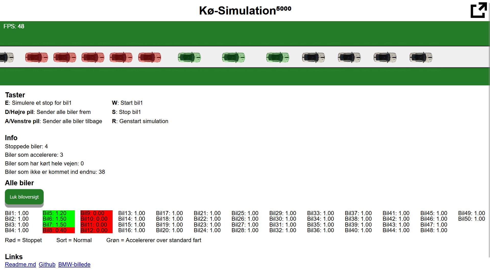

# Køkørsel SO1c

## Info
[Original code](https://editor.p5js.org/mortenTEC/sketches/_2QjZTMeJ) by [mortenTEC](https://editor.p5js.org/mortenTEC/sketches)

### Libraries
[P5.js](https://p5js.org/tutorials/setting-up-your-environment/) is required, but should be part of the repo.

### Images
SVG fullscreen icon from [Github: apancik/public-domain-icons](https://github.com/apancik/public-domain-icons/blob/master/dist/symbol%20external%20share%20link%20outside.svg)

SVG X icon from [Github: apancik/public-domain-icons](https://github.com/apancik/public-domain-icons/blob/master/dist/symbol%20cross%20delete%20remove%20multiply.svg)

BMW image from [bmwgroup.com](https://www.press.bmwgroup.com/global/photo/compilation/T0439308EN/the-new-bmw-m4-coupé-the-new-bmw-m4-convertible)

## *Gyatt*hub projekt

Stort tak til alle bidragere til projektet!

### Forord

I denne tekst præsenteres et skoleprojekt, hvor formålet har været at udvikle en simpel trafiksimulering, der er programmeret og gjort tilgængelig på GitHub. Projektet er blevet udført som en del af et kursus i softwareudvikling, og det giver en praktisk anvendelse af programmering i forbindelse med simulering af trafikforhold. Denne tekst vil gennemgå de overordnede mål for projektet, de teknologier og metoder, der er blevet brugt, samt de erfaringer, der er opnået undervejs.

### Trafikproblemer

Trafikproblemer er et væsentligt emne i dagens samfund, da trængsel på vejene kan føre til både tidspilde, øget stress og miljøbelastning. Derfor er det essentielt at kunne simulere og analysere trafikmønstre for at kunne finde løsninger på disse problemer. I dette skoleprojekt har vi valgt at udvikle en simpel trafiksimulering, der giver mulighed for at visualisere og analysere trafikflow. Simuleringen er udviklet ved hjælp af programmeringssprog som JavaScript, og koden er gjort tilgængelig på GitHub, så andre kan bidrage og videreudvikle projektet.

### Projektmål og Teknologi

Målet med dette projekt var at skabe en grundlæggende trafiksimulering, der kunne vise, hvordan trafik bevæger sig i ved kø. Simuleringen skulle tage højde for brugervenlighed og kunne justeres, så brugeren kunne ændre på forskellige parametre som antal biler og hastighedsgrænser.

Vi valgte at bruge JavaScript sammen med HTML og CSS til at skabe en grafisk brugerflade.Projektet blev oprettet på GitHub for at give både mig og andre mulighed for at arbejde med koden, dele erfaringer og forbedre simuleringen.

#### Udviklingsprocessen

Udviklingsprocessen bestod af flere faser. Først blev der lavet en detaljeret plan for, hvordan simuleringen skulle fungere, og hvilke funktioner der skulle implementeres. Efterfølgende blev der arbejdet på den bagvedliggende logik, som skulle håndtere trafikflowet. En af de største udfordringer i denne fase var at sikre, at simuleringen kunne køre effektivt og realistisk, selv når mange biler var i spil på en gang.

Derefter blev der arbejdet på at integrere brugerfladen, hvor vej og biler skulle vises og interagere med hinanden på en realistisk måde. 

En stor del af arbejdet blev også brugt på at dokumentere koden og gøre den tilgængelig på GitHub. Dette blev gjort for at gøre projektet gennemsigtigt og åbent for bidrag fra andre udviklere. Jeg lærte meget om vigtigheden af at skrive god dokumentation og bruge versionstyring, hvilket er essentielt for samarbejdsprojekter.

#### Erfaringer og Udfordringer

Undervejs i projektet stødte jeg på flere udfordringer, især i forhold til at få simuleringen til at køre hurtigt og præcist. Det var nødvendigt at optimere koden for at håndtere flere biler på én gang uden at overbelaste systemet. Jeg lærte også, at det at have en god struktur i projektet og bruge funktionelle komponenter gjorde det lettere at finde fejl og foretage rettelser.

En af de største erfaringer fra projektet var at arbejde med GitHub. Det gav mig et godt indblik i, hvordan samarbejde og versionstyring fungerer i et større udviklingsmiljø. Jeg lærte at bruge Git til at holde styr på ændringer i koden og kunne nemt samarbejde med andre, selvom de arbejdede på forskellige dele af projektet.

### Konklusion

Projektet har givet mig en dybere forståelse for, hvordan man kan bruge programmering til at simulere komplekse systemer som trafikflow. Jeg har fået erfaring med både teknisk programmering og samarbejde via GitHub, hvilket har været værdifuldt for min udvikling som programmør. Selvom simuleringen er enkel, har den givet mig en solid base for at arbejde med større og mere komplekse systemer i fremtiden.

At gøre koden tilgængelig på GitHub har også åbnet op for muligheden for, at andre kan bidrage og videreudvikle projektet. Det har været et godt eksempel på, hvordan samarbejde og åbenhed kan føre til bedre resultater. Jeg håber, at mit projekt vil kunne bruges som grundlag for videre forskning og udvikling inden for trafikoptimering og simulering.

